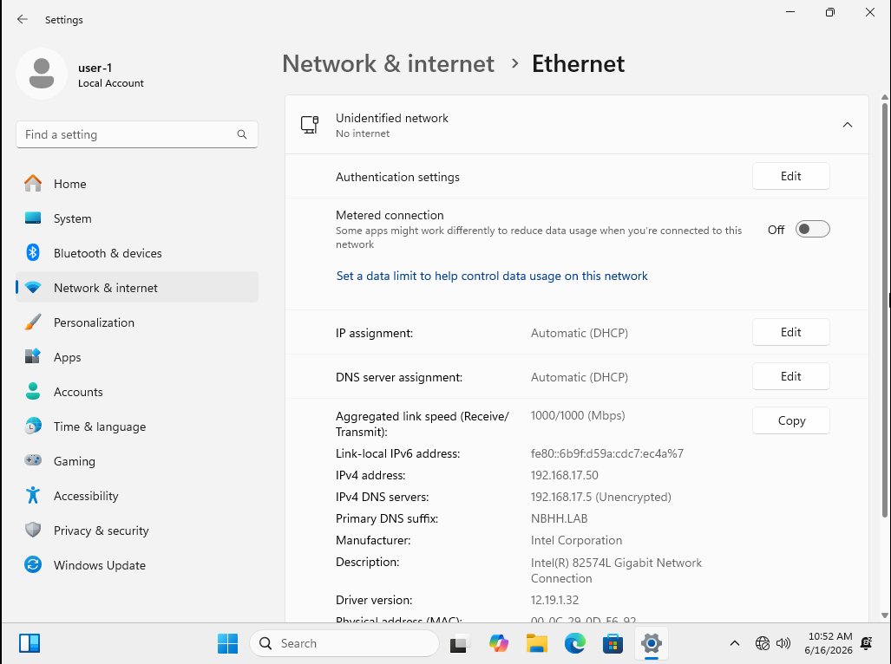

# Lab 01: Resource Group Creation

**Date**: 09-Jul-2026
**Module**: Governance
**Objective**: Create a resource group in UAE North region

## Steps
1. Azure Portal → Search "Resource groups" → + Create
2. Subscription: (my student subscription)
3. Name: rg-learning | Region: UAE North
4. Review + create → Create

## Result
Resource group created successfully.

## What I learned
- Resource group = logical container for related resources
- Deleting the RG deletes everything inside it
- The RG region only stores metadata — resources inside
  can be in other regions
  
